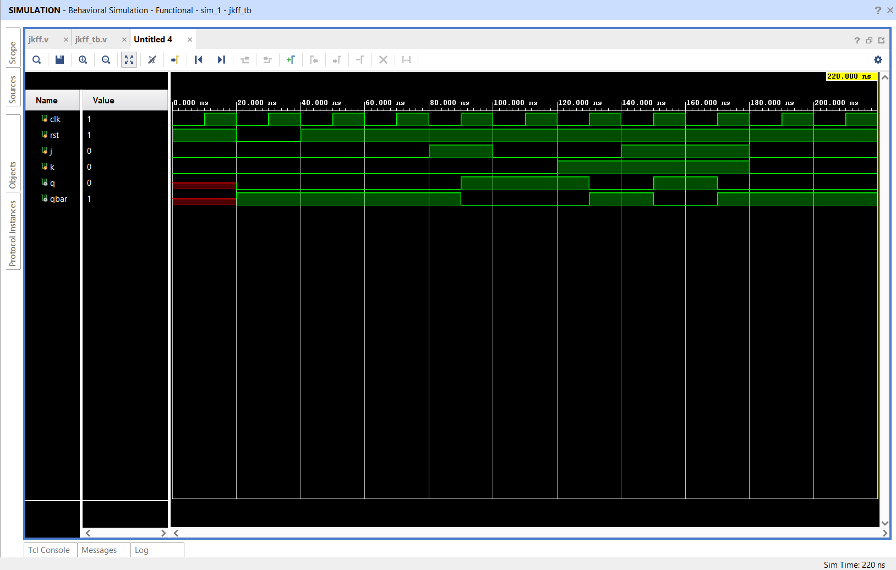
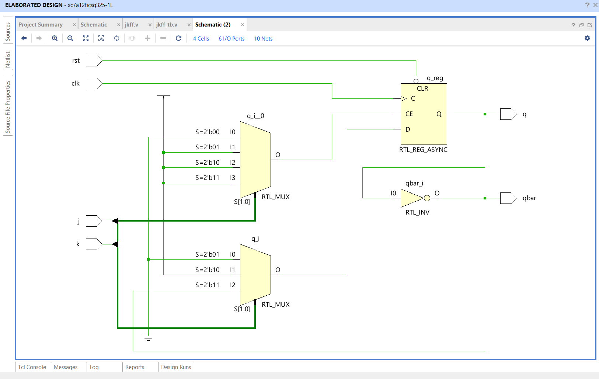
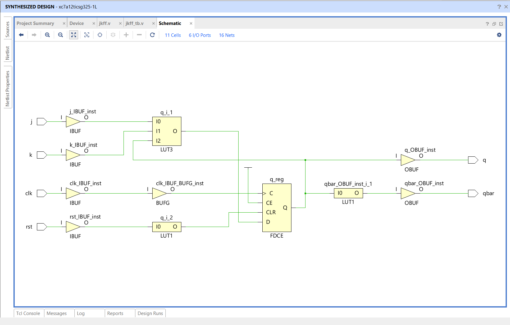

# 🔥 Clocked JK Flip-Flop with Asynchronous Active-Low Reset using Verilog HDL

## 📌 Project Overview

This project implements a **Clocked JK Flip-Flop** with an **Asynchronous Active-Low Reset** using **Verilog HDL**. The JK Flip-Flop is a fundamental sequential logic element widely used in digital systems for storing a single bit of data. Unlike the SR Flip-Flop, the JK Flip-Flop eliminates the invalid state by toggling its output when both **J** and **K** inputs are HIGH.

The design captures input data on the **positive edge of the clock** and supports an asynchronous reset that clears the output immediately when asserted.

The complete design was modeled, simulated, and verified using **Xilinx Vivado 2025.2**.

---

# 🚀 Features

- Positive Edge Triggered JK Flip-Flop
- Asynchronous Active-Low Reset
- Hold Operation
- Set Operation
- Reset Operation
- Toggle Operation
- Complementary Output (`Q̅`)
- Behavioral Simulation
- RTL Schematic Generation
- Synthesizable Verilog HDL Design

---

# 🛠️ Tools Used

- Verilog HDL
- Xilinx Vivado 2025.2
- XSim Simulator
- RTL Analysis
- Behavioral Simulation

---

# 📂 Project Structure

```
JK-FlipFlop-Verilog/
│
├── jkff.v
├── jkff_tb.v
├── waveform.png
├── rtl_schematic.png
├── schematic.png
└── README.md
```

---

# ⚙️ Functional Description

The JK Flip-Flop updates its output only on the **positive edge of the clock**.

If the asynchronous reset is asserted (`rst = 0`), the output is immediately cleared regardless of the clock.

### Truth Table

| Reset | Clock Edge | J | K | Q (Next State) |
|:-----:|:----------:|:-:|:-:|:--------------:|
| 0 | X | X | X | 0 |
| 1 | ↑ | 0 | 0 | Hold Previous State |
| 1 | ↑ | 0 | 1 | 0 |
| 1 | ↑ | 1 | 0 | 1 |
| 1 | ↑ | 1 | 1 | Toggle |

---

# 🔄 Working Principle

```
                    +---------------------------+
        J --------->|                           |
                    |     JK Flip-Flop          |
Clock ------------->|  Positive Edge Triggered  |-------> Q
                    |                           |
        K --------->|                           |-------> Q̅
                    |                           |
Reset (Active Low)->| Asynchronous Reset        |
                    +---------------------------+
```

---

# 🧪 Functional Verification

The testbench verifies the following operating conditions:

- Asynchronous Reset
- Hold State (`J = 0`, `K = 0`)
- Set Operation (`J = 1`, `K = 0`)
- Reset Operation (`J = 0`, `K = 1`)
- Toggle Operation (`J = 1`, `K = 1`)
- Multiple Clock Cycles

The simulation confirms that the JK Flip-Flop behaves correctly for all possible input combinations.

---

# 📸 Simulation Results

## Simulation Waveform



---

## RTL Schematic



---

## Elaborated Design Schematic



---

# 📖 FPGA Design Flow

- Verilog HDL Design Entry
- Behavioral Simulation
- Functional Verification
- RTL Analysis
- RTL Schematic Generation
- Logic Synthesis
- FPGA Implementation (Future Scope)

---

# 🎯 Applications

- Registers
- Shift Registers
- Binary Counters
- Frequency Dividers
- Finite State Machines (FSMs)
- Processor Control Units
- Memory Elements
- FPGA-Based Digital Systems

---

# 📚 Learning Outcomes

This project provided hands-on experience in:

- Sequential Logic Design
- JK Flip-Flop Operation
- Positive Edge Triggered Circuits
- Asynchronous Reset Design
- RTL Coding using Verilog HDL
- Testbench Development
- Functional Verification
- RTL Analysis
- Vivado FPGA Design Flow

---

# 🚀 Future Enhancements

- Parameterized JK Flip-Flop
- Enable-Controlled JK Flip-Flop
- Synchronous Reset Implementation
- Scan JK Flip-Flop for DFT
- Self-Checking SystemVerilog Testbench
- FPGA Hardware Implementation

---

# 👨‍💻 Author

**T S Sai Likhith**

Bachelor of Engineering (B.E.)  
Electronics and Communication Engineering (ECE)

### Areas of Interest

- VLSI Design
- RTL Design
- FPGA Design
- Digital IC Design
- Design Verification

---

## ⭐ Support

If you found this project useful, consider giving it a **Star ⭐** on GitHub.
